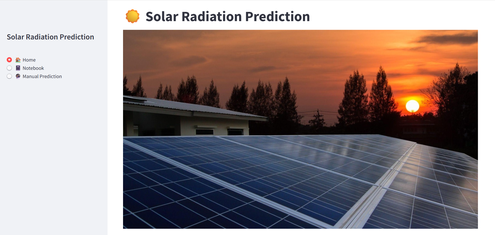

<h1 align="center" id="title">☀️ Solar Radiation Prediction App</h1>

<p align="center">
  
</p>

<p id="description">
Solar Radiation Prediction App is a machine learning-powered tool that estimates solar irradiance using meteorological and temporal features. Built for researchers, engineers, and environmentalists, this app empowers users to make informed energy and climate decisions using a user-friendly Streamlit interface.
</p>

---

## 📸 Project Screenshots

<p align="center">
  
</p>

---

## 🧠 Features

Some of the core features of the Solar Radiation App:

- 🔆 **Solar Radiation Estimation**  
  Predict solar radiation (W/m²) using features like temperature, humidity, wind direction/speed, and sun timings.

- 📓 **Notebook Viewer**  
  Interactive in-app Jupyter notebook viewer to examine model training, preprocessing, and evaluation steps.

- 📈 **Real-time Predictions**  
  Adjust inputs and get immediate predictions with downloadable history.

- 🎨 **Streamlit Web Interface**  
  Fully interactive and easy-to-use interface, no coding required.

---

## 💻 Built With

Technologies used in this project:

- Python 🐍  
- Streamlit 🎈  
- Scikit-learn 🤖  
- XGBoost 🌞  
- Pandas & NumPy 📊  
- Matplotlib & Seaborn 📉  
- Jupyter Notebook 📓

---

## 🚀 Getting Started

To run the project locally:

```bash
git clone https://github.com/vandana21102000/solar_radiation_app.git
cd solar_radiation_app
pip install -r requirements.txt
streamlit run app.py


🔗 Useful Links
📂 GitHub Repository: https://github.com/vandana21102000/solar_radiation_prediction.git

🌍 Dataset Source: Kaggle - Solar Energy Dataset https://www.kaggle.com/datasets/dronio/SolarEnergy

👩‍💻 Author
Made with ❤️ by Vandana Udayakumar

🌟 Show Your Support
If you found this project useful, don’t forget to ⭐ the repository and share it with your peers!